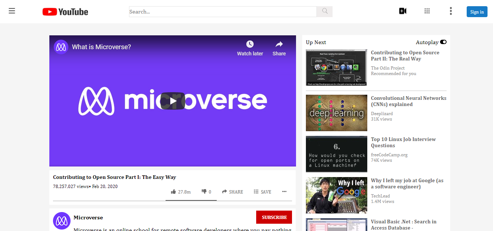

# Youtube Clone

> Youtube Clone Project assigned to us by Microverse

## Built With

- HTML,
- CSS

## Live Demo

[Live Demo Link](https://livedemo.com)

## Authors

👤 **ELIJAH AYANDOKUN**

- Github: [@githubhandle](https://github.com/ElijahTobs)
- Twitter: [@twitterhandle](https://twitter.com/elijahgr8)
- Linkedin: [linkedin](https://www.linkedin.com/in/ayandokunelijah/)

👤 **GODSON TENDONGZE**

- Github: [@githubhandle](https://github.com/tGodosn)
- Twitter: [@twitterhandle](https://twitter.com/tendongze95)
- Linkedin: [linkedin](https://linkedin.com/tendongze-godson)

## 🤝 Contributing

Contributions, issues and feature requests are welcome!

Feel free to check the [issues page](issues/).

## Show your support

Give a ⭐️ if you like this project!

## Acknowledgments

- Hat tip to anyone whose code was used
- Inspiration
- etc

## 📝 License

This project is [MIT](lic.url) licensed.
